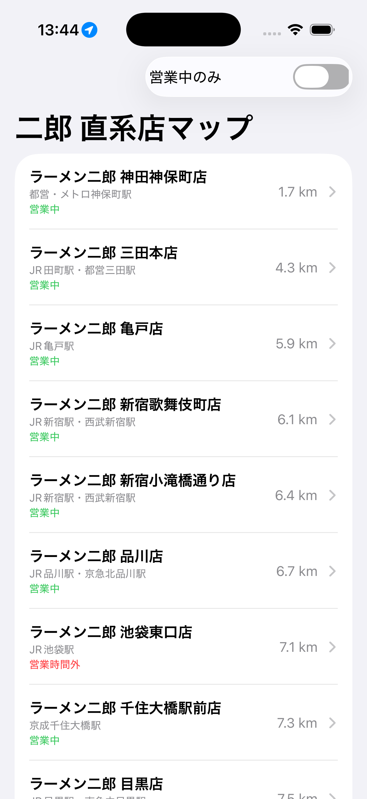
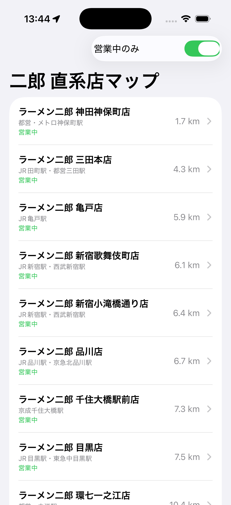
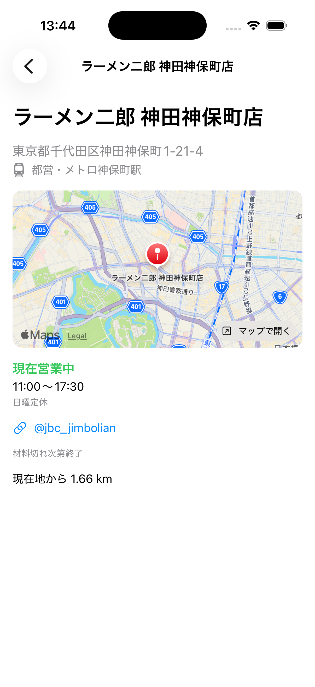

<p align="center">
  
</p>

<h1 align="center">ラーメン二郎 直系店マップ</h1>

<p align="center">
  首都圏のラーメン二郎直系店を、現在地から近い順に表示するiOSアプリです。
</p>

<p align="center">
  
  
  
</p>

## スクリーンショット

| 店舗一覧 | 営業中のみ表示 | 店舗詳細 |
|:---:|:---:|:---:|
|  |  |  |
| 現在地から近い順に並び、営業中かどうかが一目で分かります | 右上のスイッチで営業時間外の店舗を非表示にできます | 営業時間・定休日・地図を確認でき、地図をタップするとマップAppで開きます |

> スクリーンショットは東京駅を現在地として撮影しています。

## 機能

- 📍 **現在地からの距離順表示** - 最寄りの二郎直系店を簡単に見つけられます
- ⏰ **営業中フィルター** - 今営業している店舗だけを表示できます
- 🗺️ **詳細情報** - 各店舗の営業時間、定休日、最寄り駅、地図を確認できます
- 🧭 **マップAppで開く** - 詳細画面の地図をタップすると、マップAppで店舗の場所を開けます
- 🐦 **SNS連携** - 公式X（旧Twitter）アカウントへのリンク（対応店舗）

## 技術スタック

- SwiftUI
- CoreLocation（位置情報取得）
- MapKit（ジオコーディング、地図表示）
- Swift Concurrency（async/await）

## ファイル構成

```
Jiro_Search/
├── RamenJiro_Search/               # ソースコードと画像
│   ├── RamenJiro_SearchApp.swift   # アプリの起点
│   ├── StoreListView.swift         # 店舗一覧画面（距離順・営業中フィルター）
│   ├── StoreDetailView.swift       # 店舗詳細画面（地図・マップAppで開く）
│   ├── Store.swift                 # 店舗・営業時間のデータモデル
│   ├── SampleData.swift            # 首都圏の直系店38店舗のデータ
│   ├── LocationManager.swift       # 現在地の取得
│   └── Assets.xcassets/            # アプリアイコンなど
├── RamenJiro_Search.xcodeproj/     # Xcodeのプロジェクト設定
├── RamenJiro-Search-Info.plist     # アプリの設定（位置情報の利用目的など）
├── docs/images/                    # README用の画像
├── LICENSE
└── README.md
```

## 動作要件

- iOS 26.0以降
- 位置情報の許可が必要
- Xcode 26以降（ビルドする場合）

## インストール方法

このアプリはApp Storeでは配信されていません。以下の手順で自分のiPhoneで実行できます。

1. このリポジトリをクローン
   ```bash
   git clone https://github.com/shuya310/Jiro_Search.git
   ```
2. `RamenJiro_Search.xcodeproj` をXcodeで開く
3. **Signing & Capabilities** の **Team** で自分のApple ID（Personal Team、無料）を選択
4. iPhoneを接続して実行
   - 初回は iPhone の **設定 → プライバシーとセキュリティ → デベロッパモード** をオンにしてください
   - 「信頼されていないデベロッパ」と表示された場合は **設定 → 一般 → VPNとデバイス管理** から信頼してください

## シミュレータで試す場合

シミュレータには実際のGPSがないため、位置情報を手動で設定します。

1. シミュレータのメニューバー → **Features** → **Location** → **Custom Location...**
2. 東京駅の座標を入力して **OK**
   - Latitude（緯度）: `35.6812`
   - Longitude（経度）: `139.7671`
3. アプリを再起動

位置情報が取得できない場合は、東京駅の座標がデフォルトとして使われます。距離が8000km以上と表示される場合は、シミュレータの位置情報が海外（サンフランシスコなど）になっています。

## 注意事項

⚠️ 営業時間・定休日は変更されることが多いため、来店前に必ず各店舗の公式SNSで最新情報をご確認ください。

## 免責事項

このアプリは非公式のファンメイドアプリです。ラーメン二郎及び各店舗とは一切関係ありません。
掲載情報の正確性については保証いたしかねますので、必ず公式情報をご確認ください。

## ライセンス

[MIT License](LICENSE)

Copyright (c) 2026 shuya310
